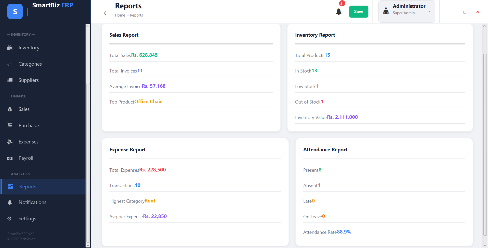
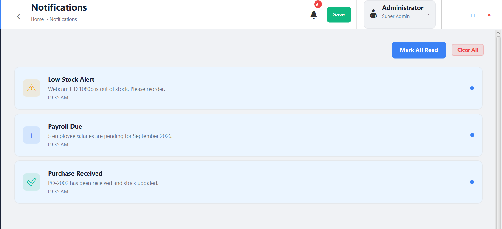
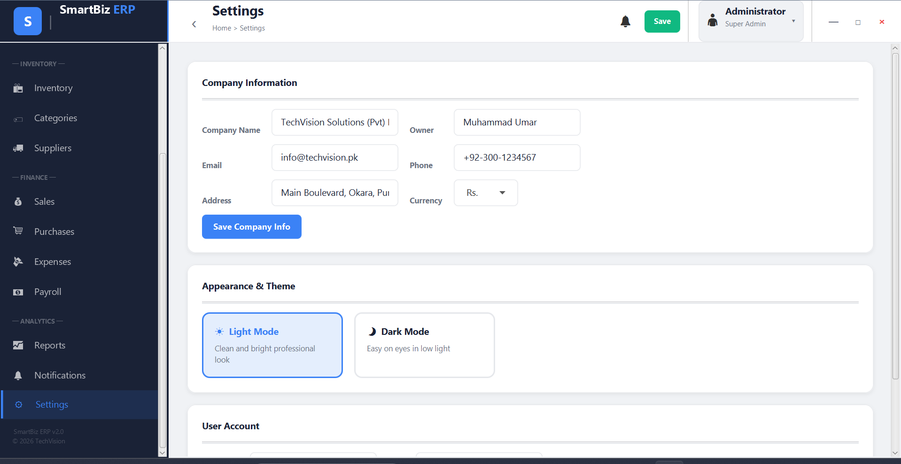

<div align="center">

# 💼 SmartBiz ERP

### Smart Business Management & Enterprise Resource Planning System


<br>


<br><br>

**A complete desktop ERP solution for managing employees, inventory, sales, purchases, expenses, payroll, reports, and everyday business operations from one unified system.**

<br>

<a href="https://github.com/MUdevelops/SmartBiz-ERP">

</a>

</div>

---

# 📌 About SmartBiz ERP

**SmartBiz ERP** is a JavaFX-based desktop Enterprise Resource Planning application designed to centralize essential business operations in a single, easy-to-use platform.

Instead of managing employees, inventory, suppliers, sales, purchases, expenses, and payroll through separate systems, SmartBiz ERP brings these workflows together under one application.

### 🎯 Built to help businesses:

* 📊 Monitor business performance
* 👥 Manage employees and departments
* 📅 Track attendance
* 📦 Control inventory and stock
* 🚚 Manage suppliers
* 💰 Handle sales and invoices
* 🛒 Manage purchases and purchase orders
* 💸 Track business expenses
* 💵 Manage payroll
* 📈 Generate reports
* 🔔 Monitor notifications
* ⚙️ Configure application settings

---

# ✨ Core Features

| Module               | Capabilities                              |
| -------------------- | ----------------------------------------- |
| 📊 **Dashboard**     | KPIs, recent activity & business overview |
| 👥 **Employees**     | Add, edit, delete & search employees      |
| 🏢 **Departments**   | Create, edit & manage departments         |
| 📅 **Attendance**    | Employee attendance management            |
| 📦 **Inventory**     | Products, stock & inventory tracking      |
| 🏷️ **Categories**   | Product category management               |
| 🚚 **Suppliers**     | Supplier information & management         |
| 💰 **Sales**         | Sales transactions & invoices             |
| 🛒 **Purchases**     | Purchase orders & management              |
| 💸 **Expenses**      | Business expense tracking                 |
| 💵 **Payroll**       | Payroll records & salary processing       |
| 📈 **Reports**       | Business reports & analytics              |
| 🔔 **Notifications** | Centralized application notifications     |
| ⚙️ **Settings**      | Application configuration                 |
| 🌙 **Themes**        | Light & dark interface                    |

---

# 🖥️ Application Screenshots

> A complete visual walkthrough of SmartBiz ERP, organized by business workflow.

---

## 📊 Dashboard

### Main Dashboard

<p align="center">

</p>

### Recent Activity

<table>
<tr>
<td width="50%" align="center">

<b>Recent Activity in Dashboard</b>

<br><br>


</td>
<td width="50%" align="center">

<b>Dashboard Overview</b>

<br><br>


</td>
</tr>
</table>

---

# 👥 Employee & Department Management

## Employee Management

<table>
<tr>
<td width="50%" align="center">

### Employees Management


</td>
<td width="50%" align="center">

### Add New Employee


</td>
</tr>

<tr>
<td width="50%" align="center">

### Edit Employee


</td>
<td width="50%" align="center">

### Delete Employee


</td>
</tr>

<tr>
<td width="50%" align="center">

### Search by Name


</td>
<td width="50%" align="center">

### Filter by Department


</td>
</tr>
</table>

---

## 🏢 Department Management

<table>
<tr>
<td width="50%" align="center">

### Department Management


</td>
<td width="50%" align="center">

### Add New Department


</td>
</tr>

<tr>
<td width="50%" align="center">

### Edit Department


</td>
<td width="50%" align="center">

</td>
</tr>
</table>

---

## 📅 Attendance Management

<p align="center">

</p>

---

# 📦 Inventory Management

## Inventory Overview

<p align="center">

</p>

## Product Management

<table>
<tr>
<td width="50%" align="center">

### Add New Product


</td>
<td width="50%" align="center">

### Edit Product


</td>
</tr>

<tr>
<td width="50%" align="center">

### Delete Product


</td>
<td width="50%" align="center">

### Add Stock


</td>
</tr>
</table>

---

## 🏷️ Category Management

<p align="center">

</p>

---

## 🚚 Supplier Management

<p align="center">

</p>

---

# 💰 Sales Management

## Sales Dashboard

<p align="center">

</p>

## 🧾 Invoice Generation

<p align="center">

</p>

---

# 🛒 Purchase Management

<table>
<tr>
<td width="50%" align="center">

### Purchase Management


</td>
<td width="50%" align="center">

### New Purchase Order


</td>
</tr>

<tr>
<td width="50%" align="center">

### Cancel Purchase Order


</td>
<td width="50%" align="center">

</td>
</tr>
</table>

---

# 💸 Expense Management

<table>
<tr>
<td width="50%" align="center">

### Expense Management


</td>
<td width="50%" align="center">

### Add Expense


</td>
</tr>

<tr>
<td width="50%" align="center">

### Edit Expense


</td>
<td width="50%" align="center">

### Delete Expense


</td>
</tr>
</table>

---

# 💵 Payroll Management

<table>
<tr>
<td width="50%" align="center">

### Payroll Management


</td>
<td width="50%" align="center">

### Payroll Records


</td>
</tr>

<tr>
<td width="50%" align="center">

### Process Pending Salaries


</td>
<td width="50%" align="center">

</td>
</tr>
</table>

---

# 📈 Reports & Analytics

<p align="center">

</p>

---

# 🔔 Notifications

<table>
<tr>
<td width="50%" align="center">

### Notifications



</td>
<td width="50%" align="center">

### Clear Notifications


</td>
</tr>
</table>

---

# ⚙️ Settings & Themes

## Settings

<p align="center">

</p>

## 🌙 Dark Theme

<p align="center">

</p>

---

# 🧩 Complete Module Architecture

```text
                         ┌──────────────────────┐
                         │     SmartBiz ERP     │
                         │     JavaFX Desktop   │
                         └──────────┬───────────┘
                                    │
          ┌─────────────────────────┼─────────────────────────┐
          │                         │                         │
          ▼                         ▼                         ▼
     MANAGEMENT                 INVENTORY                  FINANCE
          │                         │                         │
    ┌─────┼─────┐           ┌───────┼───────┐        ┌──────┼──────┐
    │     │     │           │       │       │        │      │      │
Employees Dept Attendance  Products Categories Suppliers Sales Purchases
                                                        │      │
                                                        └──┬───┘
                                                           │
                                                    Expenses / Payroll
                                                           │
                                                           ▼
                                                    REPORTS & ANALYTICS
```

---

# 🛠️ Technology Stack

<div align="center">

| Technology                | Role                        |
| ------------------------- | --------------------------- |
| ☕ **Java**                | Core programming language   |
| 🎨 **JavaFX**             | Desktop UI framework        |
| 📊 **JavaFX Charts**      | Business visualization      |
| 🗂️ **Java Collections**  | Application data management |
| 🕒 **Java Time API**      | Date & time handling        |
| 💾 **Local Data Storage** | Application persistence     |

</div>

---

# 🚀 Getting Started

## 1. Clone the Repository

```bash
git clone https://github.com/MUdevelops/SmartBiz-ERP.git
cd SmartBiz-ERP
```

## 2. Requirements

Make sure you have:

* ☕ Java JDK
* 🎨 JavaFX SDK
* 💻 A Java-compatible IDE

Verify Java:

```bash
java -version
```

Verify the compiler:

```bash
javac -version
```

## 3. Run

Open the project in your preferred Java IDE and configure JavaFX.

Run:

```text
SmartBizERP.java
```

---

# 📂 Project Structure

```text
SmartBiz-ERP/
│
├── 📁 Screenshots/
│   ├── Main Dashboard.png
│   ├── Employees Management.png
│   ├── Inventory Management.png
│   ├── Sales Management.png
│   ├── Purchase Management.png
│   ├── Payroll Management.png
│   ├── Report.png
│   └── ...
│
├── 📄 SmartBizERP.java
├── 📄 README.md
└── 📄 LICENSE
```

---

# 🎯 Project Highlights

### 💼 Complete Business Workflow

SmartBiz ERP connects multiple business operations inside one application.

### 🖥️ Desktop-First Experience

Built with JavaFX to provide a dedicated desktop business-management interface.

### 📊 Data Visibility

Dashboards, reports, recent activity and business modules make important information easier to monitor.

### 🎨 Modern Interface

The application includes organized navigation, visual dashboards and theme support.

### 🧩 Modular Functionality

Different business areas are separated into dedicated modules while remaining part of one ERP platform.

---

# 🔮 Future Enhancements

Potential future improvements include:

* 🔐 User authentication & role-based access
* 🗄️ MySQL/PostgreSQL database integration
* ☁️ Cloud synchronization
* 🌐 Web-based ERP version
* 📱 Mobile companion application
* 📄 Advanced PDF invoice generation
* 📤 Excel/CSV export
* 📊 Advanced business analytics
* 🔄 Automated database backups
* 🛡️ Audit logs
* 🌍 Multi-branch business support

---

# 🤝 Contributing

Contributions and suggestions are welcome.

```bash
# Fork the repository
# Create a feature branch
# Make your changes
# Commit your changes
# Push your branch
# Open a Pull Request
```

---

# 📜 License

This project is licensed under the **MIT License**.

See the [`LICENSE`](LICENSE) file for details.

---

# 👨‍💻 Developer

<div align="center">

## Muhammad Umar Jamal

### Software Developer | BSCS Student

Building practical software solutions with a focus on application development, automation and real-world problem solving.

<br>

<a href="https://github.com/MUdevelops">

</a>

<a href="https://m-umar-jamal.netlify.app/">

</a>

</div>

---

<div align="center">

### ⭐ Like the project?

**Give SmartBiz ERP a star on GitHub!**

<br>


### Built with ☕ Java & 🎨 JavaFX

</div>
